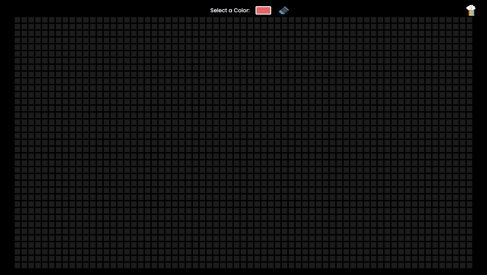

## Description:
A simple web application without a FrameWork. This project it's a simple pixel painting, the development of this web page required Dom's manipulation, knowledge of events, Elements and Local Storage.

## Starting Project:
1. Cloning the repository
-  `git clone git@github.com:Vincenzofdg/Pixel_Art.git`
2. Enter in the directory folder
- `cd Pixel_Art`
3. Iniciate `server.mjs`
- `node server.mjs`

 

